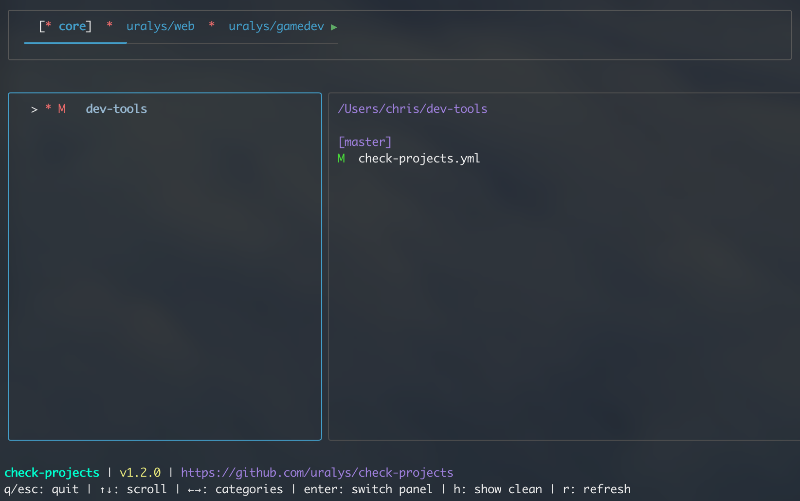

# check-projects

A fast, cross-platform CLI tool to check the git status of multiple projects organized by categories.

```sh
x mozilla
  * M firefox
  ✱ ✚ thunderbird

✔ godot

x gamedev
  ⬆ flying-ones
  * M avindi
```

## Features

- **Interactive TUI mode** - Navigate projects with a modern terminal UI
- **Multi-category organization** - Group projects by team, client, or category
- **Auto-discovery** - Automatically scan directories for git repositories
- **Fast concurrent checks** - Parallel git status checks
- **Smart filtering** - Hide clean projects, search by name
- **Cross-platform** - Single binary for macOS, Linux, and Windows

## Quick Start

### Install

```bash
curl -fsSL https://raw.githubusercontent.com/uralys/check-projects/main/install.sh | sh
```

[Other installation methods →](docs/installation.md)

### Configure

Create `~/check-projects.yml`:

```yaml
categories:
  - name: personal
    root: ~/Projects/personal

  - name: work
    root: ~/Projects/work
    ignore:
      - "*-deprecated"

display:
  hide_clean: true

# Optional: set defaults
use_tui_by_default: false  # Set to true to always use TUI mode
fetch: true                # Set to true to always fetch from remote
```

[Full configuration guide →](docs/configuration.md)

### Run

```bash
# CLI mode (simple output)
check-projects

# TUI mode (interactive)
check-projects --tui

# Fetch from remote before checking
check-projects --fetch
```

## Usage

### CLI Mode

```bash
check-projects                    # Check all projects
check-projects -v                 # Show all (including clean)
check-projects --category work    # Check specific category
check-projects -f                 # Fetch from remote first
check-projects --fetch            # Same as -f
```

### TUI Mode

```bash
check-projects --tui
```



**Navigate** with `↑↓` • **Switch categories** with `←→` • **Git status shown automatically on right**

[Full TUI guide →](docs/tui-mode.md)

## Status Symbols

- `✔` Clean (synced with remote)
- `⬆` Ahead of remote
- `⬆⬆` Diverged from remote
- `* M` Modified files
- `* D` Deleted files
- `✱ ✚` Untracked files
- `❌` Error

## Documentation

- [Installation](docs/installation.md)
- [Configuration](docs/configuration.md)
- [TUI Mode](docs/tui-mode.md)
- [Changelogs](changelogs/index.md)

## Development

```bash
make deps      # Install dependencies
make build     # Build binary
make test      # Run tests
make lint      # Run linter
```

## License

MIT
